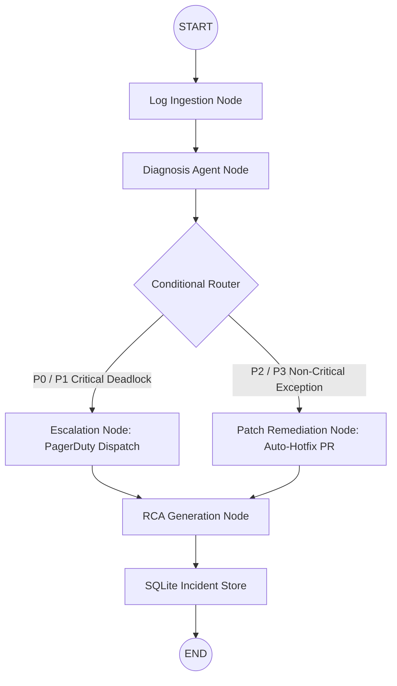

# 🤖 Autonomous Production Incident Triage Agent (LangGraph)
## Project Architecture & Engineering Blueprint

---

## 📌 Executive Summary
The **Autonomous Production Incident Triage Agent** is a multi-agent AI system designed to automate root-cause analysis (RCA), log diagnosis, and incident remediation in modern cloud/fintech environments. Built with **LangGraph**, **FastAPI**, **Streamlit**, and **SQLite**, it simulates real-world DevOps triage workflows by ingesting production crash logs, correlating system metrics, determining root causes, executing conditional escalations, and drafting automated patch workflows.

---

## 🎯 Key Capabilities & Technical Highlights
1. **Multi-Agent State Machine (LangGraph):** Orchestrates discrete agent nodes (`log_ingestion_node` → `diagnosis_node` → `route_by_severity` → `escalation_node` / `patch_remediation_node` → `rca_generation_node`) with state persistence.
2. **Log & Telemetry Parsing:** Extracts stack traces, HTTP error codes (500s, 404s, 504 Timeouts), memory/CPU spikes (OOMKilled), and database deadlock signatures (`PSQLException`).
3. **Automated RCA Generation:** Synthesizes structured markdown Root Cause Analysis reports detailing issue severity, root cause, impacted components, and immediate remediation action items.
4. **Persistent Incident Memory (SQLite):** Stores triaged incident history in `incidents_history.db` for post-mortem analysis and audit lookup.
5. **Interactive REST API & Dashboard:** Exposes FastAPI endpoints (`/api/v1/triage`, `/api/v1/incidents`) alongside an interactive Streamlit UI (`app.py`).

---

## 🏗️ System Architecture & Workflow Diagram

---

## 🛠️ Tech Stack & Engineering Practices
- **Agent Orchestration:** LangGraph `StateGraph`, TypedDict state schemas, conditional edge routers.
- **Backend API:** FastAPI async endpoints, Pydantic data schemas, OpenAPI Swagger documentation.
- **Frontend Dashboard:** Streamlit UI with metric cards, preset logs, and markdown viewers.
- **Database:** SQLite incident store with SQL schema initialization and query methods.
- **DevOps & Containerization:** Dockerfile & Docker Compose multi-container orchestration.

---

## 🎤 Interview Talking Points
- *"I built an autonomous incident management agent using LangGraph to reduce Mean Time to Resolution (MTTR) for production outages."*
- *"The agent uses a graph-based state machine that dynamically routes P0 database deadlocks to human escalations while auto-generating code patches for application runtime exceptions."*
- *"Built with FastAPI, Streamlit, and SQLite, it allows CI/CD systems or Datadog/Sentry webhooks to trigger instant automated log diagnosis and record post-mortem history."*

